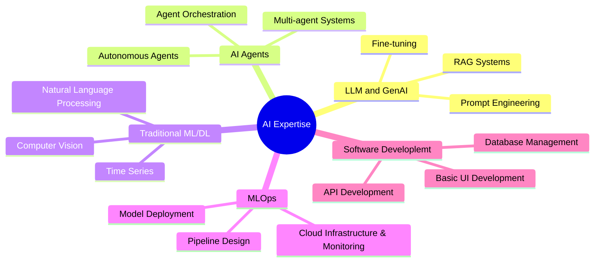
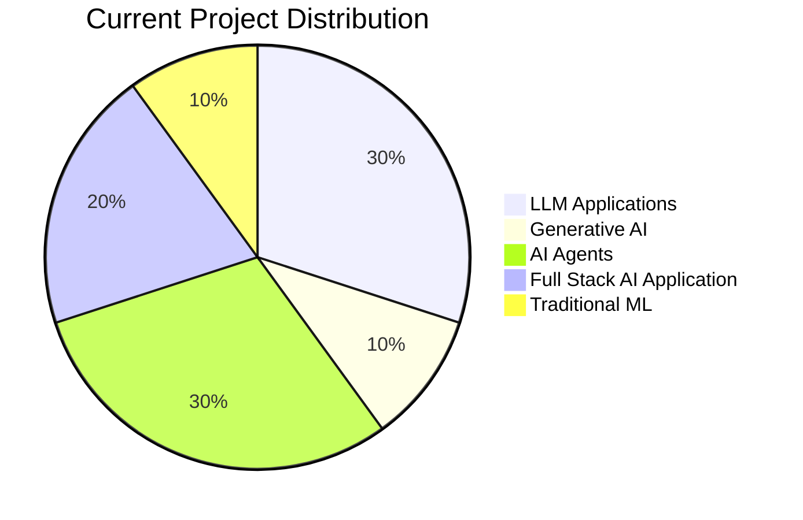

# 👋 Hello, I'm Manthan 
### AI/ML Engineer | LLM & GenAI Specialist | Software Engineer II at Bristol Myers Squibb 🚀

> Transforming ideas into AI realities through code and innovation.

## 🎯 What I'm Up To
- 🤖 Specializing in **Large Language Models**, **Generative AI**, and **AI Agents**
- 🔬 Researching and implementing cutting-edge AI solutions in healthcare
- 🌱 Building scalable AI/ML pipelines and architectures
- 👥 Open to collaboration on innovative AI projects
- 📚 Exploring the path to Artificial General Intelligence (AGI)

## 🛠️ Technology Arsenal

### 🧠 AI/ML Ecosystem
```
LLM & GenAI Tools   │  ML Frameworks       │  Data Science
────────────────────────────────────────────────────────────
▣ LangChain         │  ▣ PyTorch           │  ▣ NumPy
▣ CrewAI            │  ▣ TensorFlow        │  ▣ Pandas
▣ LangGraph         │  ▣ Keras             │  ▣ Scikit-learn
▣ Phidata           │  ▣ Transformers      │  ▣ SciPy
```

### 🔧 Development Stack
```
Backend             │  Frontend           │  DevOps & Tools
────────────────────────────────────────────────────────────
▣ FastAPI           │  ▣ ReactJS          │  ▣ Docker
▣ Django            │  ▣ Streamlit        │  ▣ Git
▣ Flask             │  ▣ Gradio           │  ▣ MLflow
▣ PostgreSQL        │  ▣ Plotly           │  ▣ DVC
```

### 🎨 Visualization & Analysis
```
Data Visualization │  Computer Vision        │  NLP Tools
────────────────────────────────────────────────────────────
▣ Matplotlib       │  ▣ OpenCV               │  ▣ spaCy
▣ Seaborn          │  ▣ PIL                  │  ▣ NLTK
▣ Plotly           │  ▣ Scikit-Learn Image   │  ▣ Hugging Face
▣ Bokeh            │  ▣ MediaPipe            │  ▣ Tokenizers
```

### 🚀 ML Deployment & Scaling
```
Model Serving      │  Monitoring     │  Infrastructure
────────────────────────────────────────────────────────────
▣ BentoML          │  ▣ MLflow       │  ▣ AWS
-                  |  ▣ Grafana      |  ▣ GCP
```

### 💻 Expertise Level
```python
{
    "Expert":        ["Python", "AI ML Development"],
    "Intermediate":  ["Backend Development", "Visualization &  Analysis",],
    "Learning":      ["Model Serving", "Model Deployment", "Monitoring Tools"]
}
```


## 🎓 Core Expertise Areas



## 🎯 Project Focus Areas



## 🤝 Connect & Collaborate

<div align="center">

[](https://manthan-bhikadiya.wixsite.com/profile)
[](https://www.linkedin.com/in/manthanbhikadiya)
[](https://manthan-bhikadiya.medium.com/)
[](mailto:bhikadiyamanthan@gmail.com)
[](https://github.com/manthan89-py)
[](https://twitter.com/your-twitter)

</div>

<div align="center">


</div>
