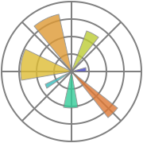
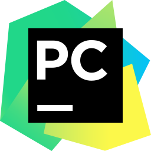

# Hello Developers 🧠
## Welcome to My Github Profile 🔥

- 🔭 I’m currently working on Data Science, Deep learning, Machine learning and Computer Vision
- 🌱 I’m currently learning Artifical Intelligence and Deep learning.
- 🤔 I’m looking for help with AI , DL, ML, CV.
- 💬 Ask Me About Machine Learning , Deep learning Basics.
- 🌟 In My Github You Can Find Projects Related to Machine learning and Deep learning. 

## Connect with me 🤝
- Portfolio ☞: https://manthan-bhikadiya.wixsite.com/profile  
- Medium    ☞: https://manthan-bhikadiya.medium.com  
- Linkedin  ☞: https://www.linkedin.com/in/manthanbhikadiya  
- Instagram ☞: https://www.instagram.com/manthan.bhikadiya  

## Tools and Technology

### Languages ⭐
<table>
  <tr>
    <th></th>
    <th></th> 
  </tr>
  <tr>
    <th>Python</th>
    <th>Dart</th> 
  </tr>
</table> 

### Frameworks ⭐
<table>
  <tr>
    <th></th>
    <th></th> 
     <th></th>
    <th></th>
    <th></th>
    <th></th>
    <th></th>
    <th></th>
    <th></th>
  </tr>
  <tr>
    <th>Tensorflow</th>
    <th>PyTorch</th>
    <th>Pandas</th>
    <th>Keras</th>
    <th>Scikit-Learn</th>
    <th>Numpy</th>
    <th>Matplotlib</th>
    <th>Seaborn</th>
    <th>Flutter</th>
  </tr>
</table> 

### Tools & IDE ⭐
<table>
  <tr>
    <th></th>
    <th></th> 
     <th></th>
    <th></th>
    <th></th>
    <th></th>
    <th></th>
  </tr>
  <tr>
    <th>Jupyter</th>
    <th>Pycharm</th>
    <th>Visual Studio</th>
    <th>Tableau</th>
    <th>Google Colab</th>
    <th>Anaconda</th>
    <th>Paperspace</th>
  </tr>
</table> 

### Connect with Me ⭐
<table>
  <tr>
    <th></th>
    <th></th>
    <th></th>
    <th></th>
    <th></th>
  </tr>
  <tr>
    <th>Portfolio</th>
    <th>Gmail</th>
    <th>Linkedin</th> 
    <th>Medium</th>
    <th>Instagram</th>
  </tr>
</table> 

## Github Stats 📊

## NOTE 🔴
✠If You Like Any of My Repo. Give It ⭐. It Will Motivate Me.  
✠Please Raise ✋ Issues If Any Have.  
✠You Can Follow ✅ Me So That You Will Get Informed About My Projects.  
➜ Thank You Very Much ❤️ For Visiting My Profile.

